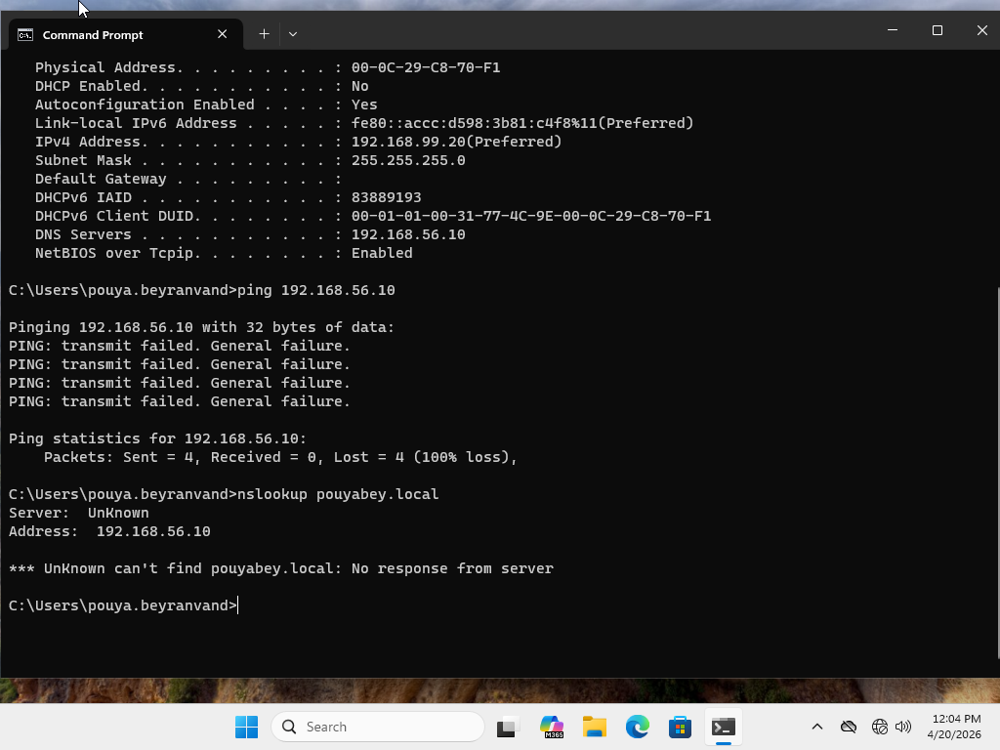
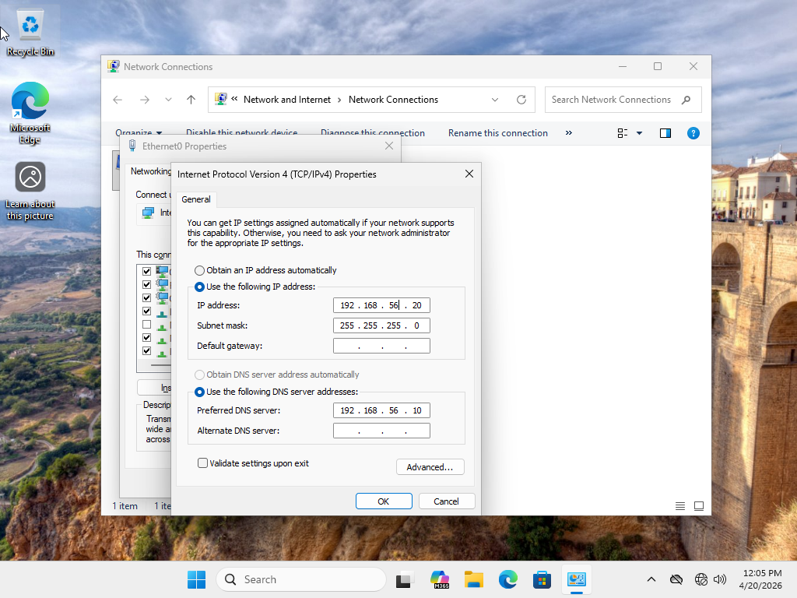
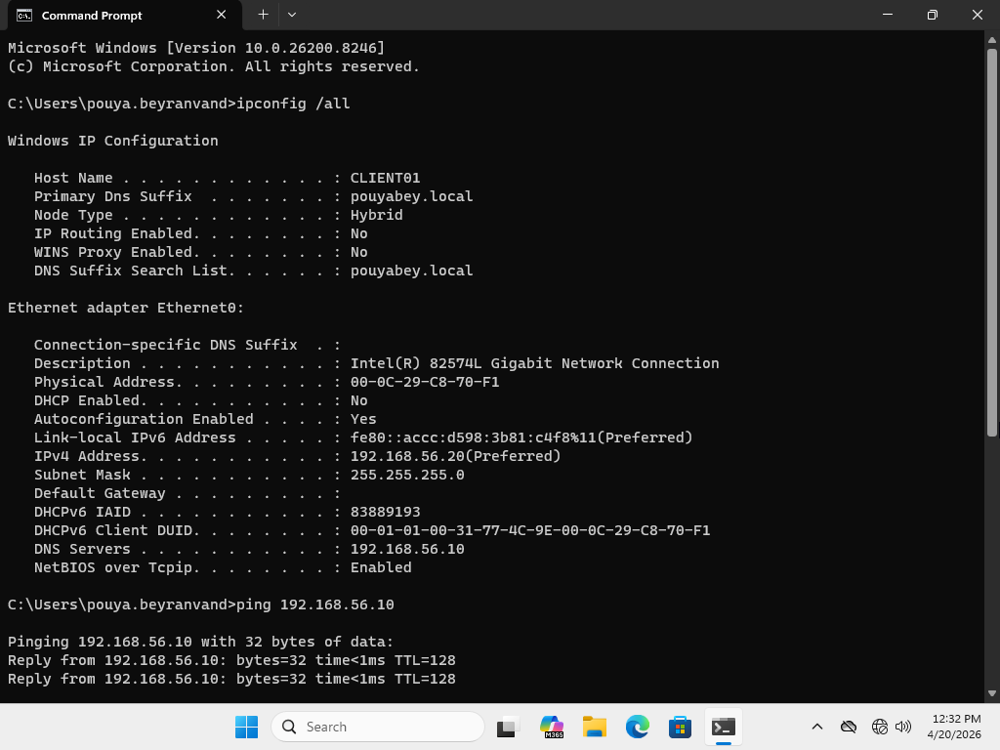
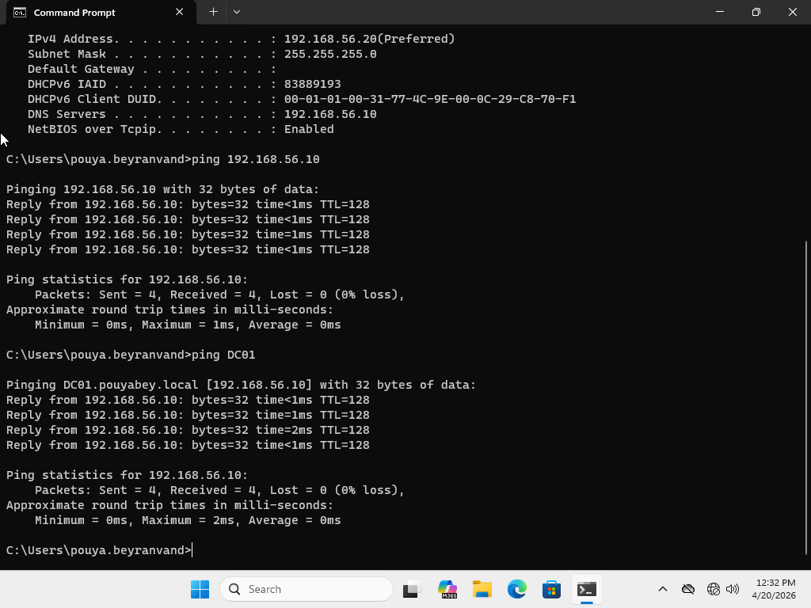

# Ticket 01: User Has No Internet Access / Network Connectivity Issue

## User Report

The user reported that they could not access the network or internal resources from their Windows workstation.

## Lab Environment

- Windows Server Domain Controller
- Windows 11 domain-joined client
- Host-only virtual network
- Static IPv4 configuration
- DNS configured through the Domain Controller
- Active Directory lab environment

## Important Lab Note

This lab uses a host-only virtual network. Because of this, the troubleshooting scenario focuses on internal network connectivity, including access to the Domain Controller, DNS resolution, and domain resources. Public internet access is not required for this scenario.

## Initial Symptoms

The Windows 11 client was unable to communicate with the Domain Controller. The user could not access internal network resources, and DNS resolution for the lab domain failed.

## Possible Causes Considered

- Incorrect IP address
- Wrong subnet configuration
- Incorrect DNS server
- Disabled network adapter
- Host-only adapter misconfiguration
- Domain Controller unreachable
- DNS service unavailable

## Troubleshooting Steps

1. Checked the network adapter status.
2. Reviewed the workstation IP configuration using `ipconfig /all`.
3. Identified that the client had a static IP address on the wrong subnet.
4. Tested connectivity to the Domain Controller using `ping`.
5. Tested DNS resolution using `nslookup`.
6. Confirmed that the client could not reach the Domain Controller or DNS server.
7. Corrected the IPv4 address and subnet configuration.
8. Verified that the preferred DNS server pointed to the Domain Controller.
9. Flushed the DNS cache.
10. Retested connectivity to the Domain Controller.
11. Verified DNS resolution for the lab domain.
12. Confirmed domain communication using `gpupdate /force`.


## Commands Used

```cmd
ipconfig /all
ping 192.168.56.10
ping DC01
nslookup lab.local
ipconfig /flushdns
gpupdate /force
whoami
```

## Root Cause

The Windows 11 client had an incorrect static IPv4 address on the wrong subnet. Because of this, the workstation could not communicate with the Domain Controller or use the Domain Controller for DNS resolution.

## Resolution

The client’s IPv4 settings were corrected to match the host-only lab subnet. The preferred DNS server was set to the Domain Controller’s IP address. After correcting the IP configuration and flushing the DNS cache, connectivity to the Domain Controller and DNS resolution were restored.

## Verification

The issue was verified as resolved by successfully running:

```cmd
ping 192.168.56.10
ping DC01
nslookup lab.local
gpupdate /force
```

## Screenshots

### 1. IP Configuration and Connectivity Failure



### 2. Corrected IPv4 and DNS Configuration



### 3. Post-Fix Connectivity and Domain Verification






### 4. IP Configuration and Connectivity Failure


### 5. Corrected Static IP Settings


### 6. Resolved IP Configuration


### 7. Successful Ping to Domain Controller


### 8. Successful DNS Lookup


### 9. Successful Group Policy Update


## Skills Demonstrated

- Windows network troubleshooting
- Host-only virtual network troubleshooting
- IPv4 configuration review
- Static IP troubleshooting
- DNS server verification
- Domain Controller connectivity testing
- Command-line diagnostics
- Group Policy connectivity validation
- Help Desk ticket documentation


