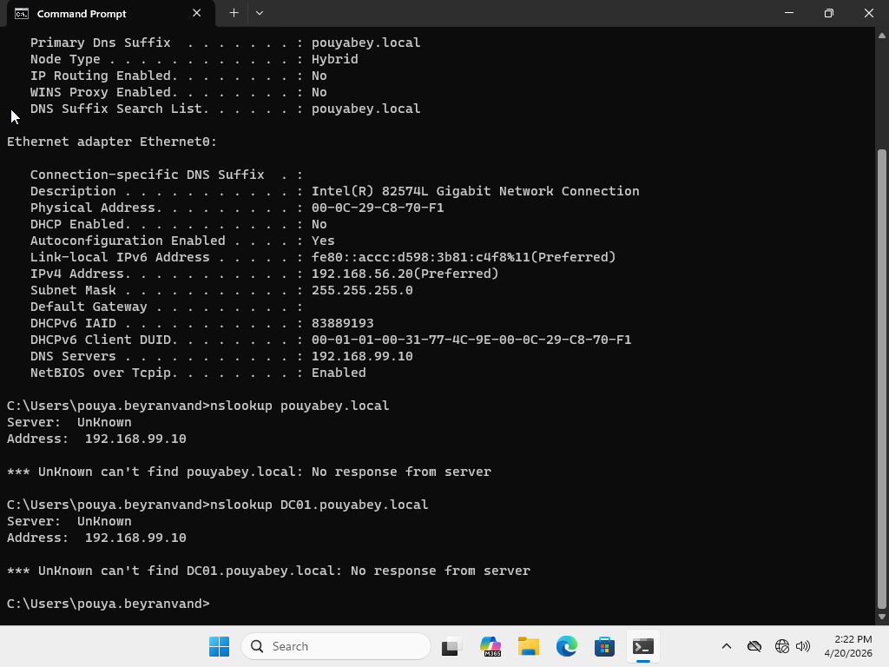
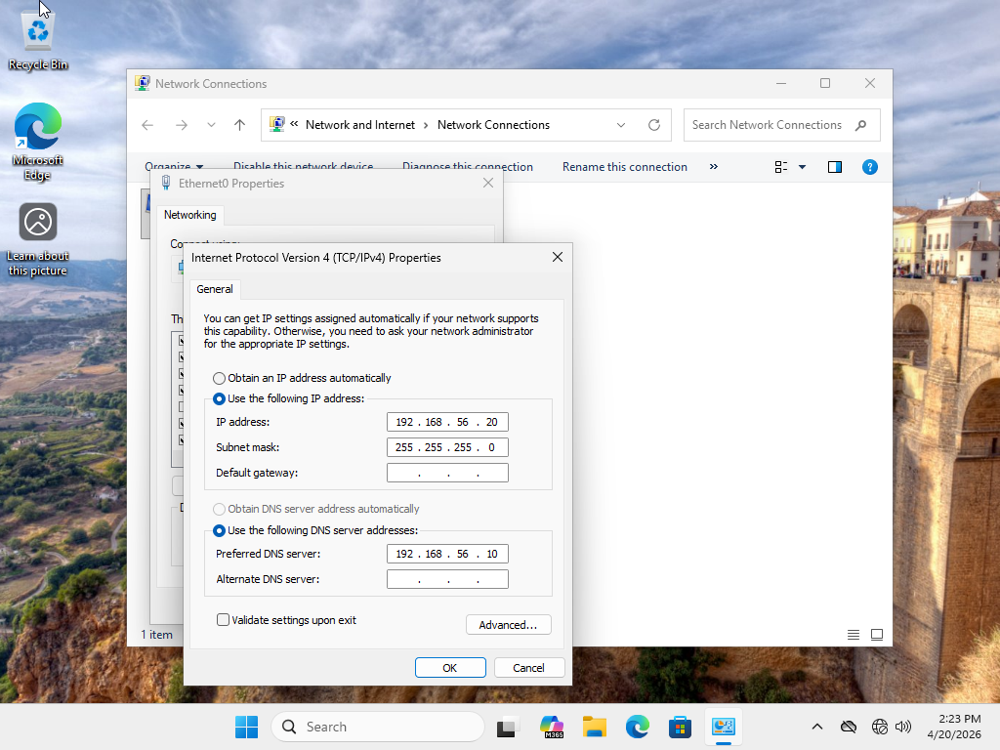
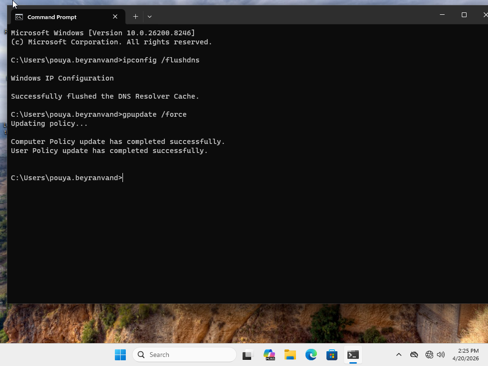
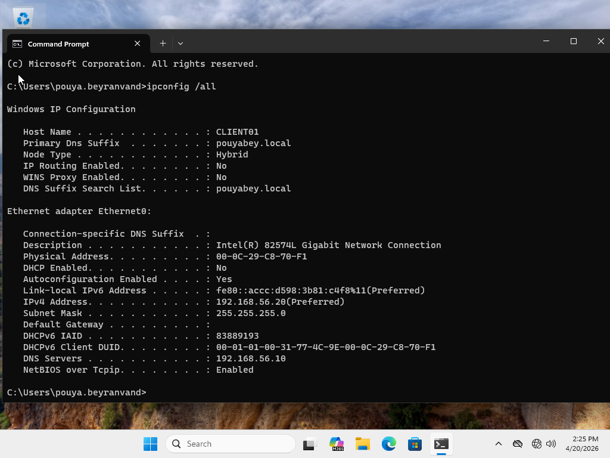
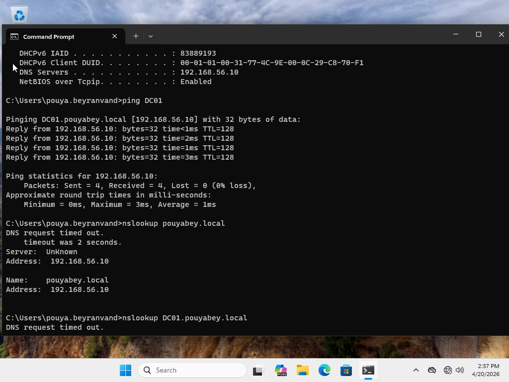

# Ticket 02: DNS Resolution Issue

## User Report

The user reported that they could access the network, but could not access internal resources by name. The workstation could reach the Domain Controller by IP address, but domain and server names were not resolving correctly.

## Lab Environment

- Windows Server Domain Controller
- Windows 11 domain-joined client
- Active Directory Domain Services
- DNS configured through the Domain Controller
- Host-only virtual network
- Static IPv4 configuration

## Important Lab Note

This lab uses a host-only virtual network. Because of this, the scenario focuses on internal DNS resolution for the Active Directory domain and Domain Controller rather than public internet name resolution.

## Initial Symptoms

The Windows 11 client had network connectivity to the Domain Controller by IP address, but DNS resolution failed for the lab domain and server name. This prevented reliable access to domain resources by hostname.

## Possible Causes Considered

- Incorrect DNS server configured on the client
- DNS server unreachable
- DNS Client cache issue
- Domain Controller DNS service issue
- Incorrect static IPv4 configuration
- Host-only adapter misconfiguration

## Troubleshooting Steps

1. Reviewed the workstation IP configuration using `ipconfig /all`.
2. Confirmed that the client had a valid IP address on the correct host-only subnet.
3. Tested connectivity to the Domain Controller by IP address using `ping`.
4. Tested DNS resolution using `nslookup pouyabey.local` and `nslookup DC01.pouyabey.local`.
5. Confirmed that IP connectivity worked, but DNS lookups failed.
6. Identified that the Preferred DNS Server was configured incorrectly.
7. Corrected the Preferred DNS Server to point to the Domain Controller IP address.
8. Flushed the DNS resolver cache using `ipconfig /flushdns`.
9. Retested DNS resolution for the lab domain and Domain Controller hostname.
10. Verified domain communication using `gpupdate /force`.

## Commands Used

```cmd
ipconfig /all
ping 192.168.56.10
nslookup pouyabey.local
nslookup DC01.pouyabey.local
ipconfig /flushdns
gpupdate /force
```

## Root Cause

The Windows 11 client had an incorrect DNS server configured. Because the workstation was not using the Domain Controller as its DNS server, it could not resolve the Active Directory domain or Domain Controller hostname correctly.

## Resolution

The Preferred DNS Server was corrected to the Domain Controller IP address. After updating the DNS configuration, the DNS resolver cache was flushed and name resolution was tested again.

## Verification

The issue was verified as resolved by successfully running:

```cmd
ping 192.168.56.10
nslookup pouyabey.local
nslookup DC01.pouyabey.local
gpupdate /force
```

## Screenshots

### 1. DNS Resolution Failure



### 2. Corrected DNS Server Configuration



### 3. DNS Resolution Restored




