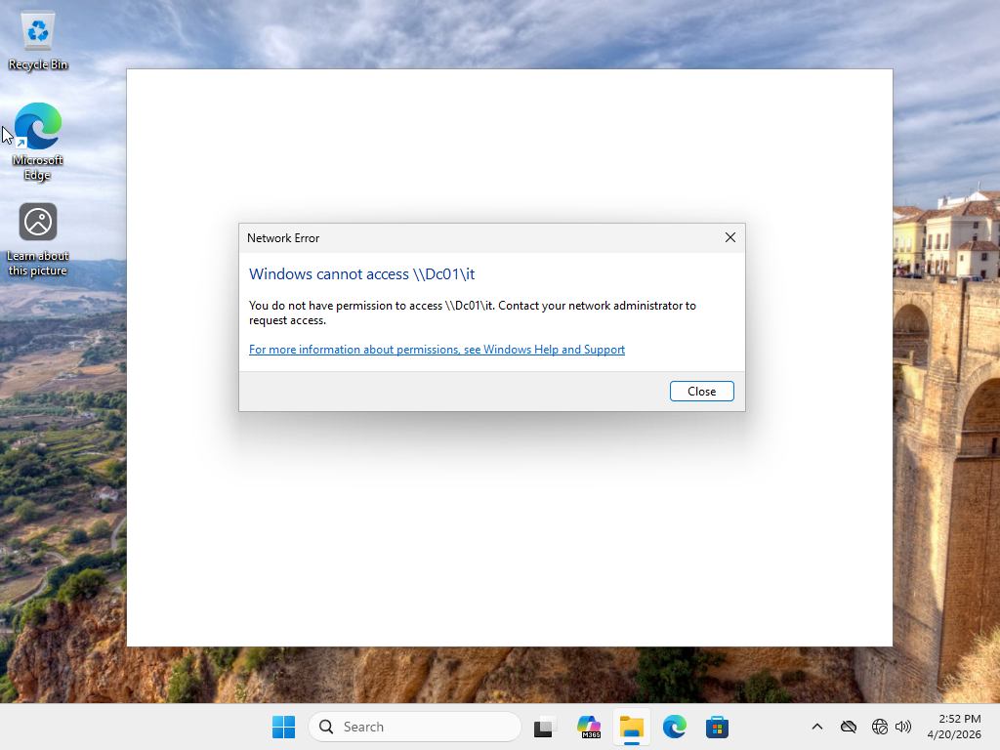
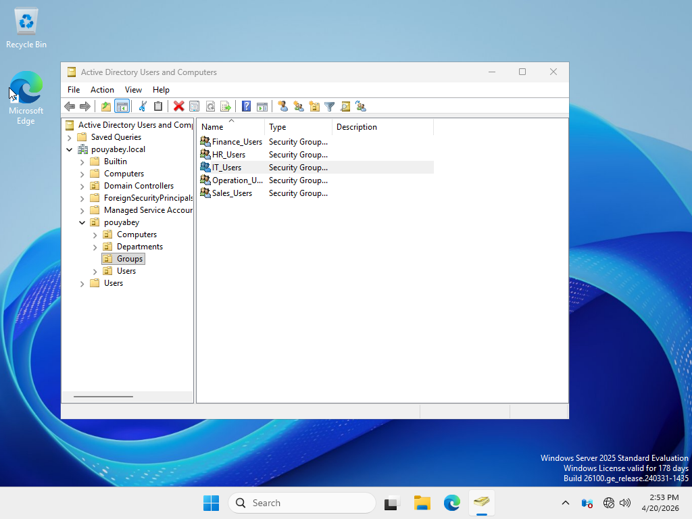
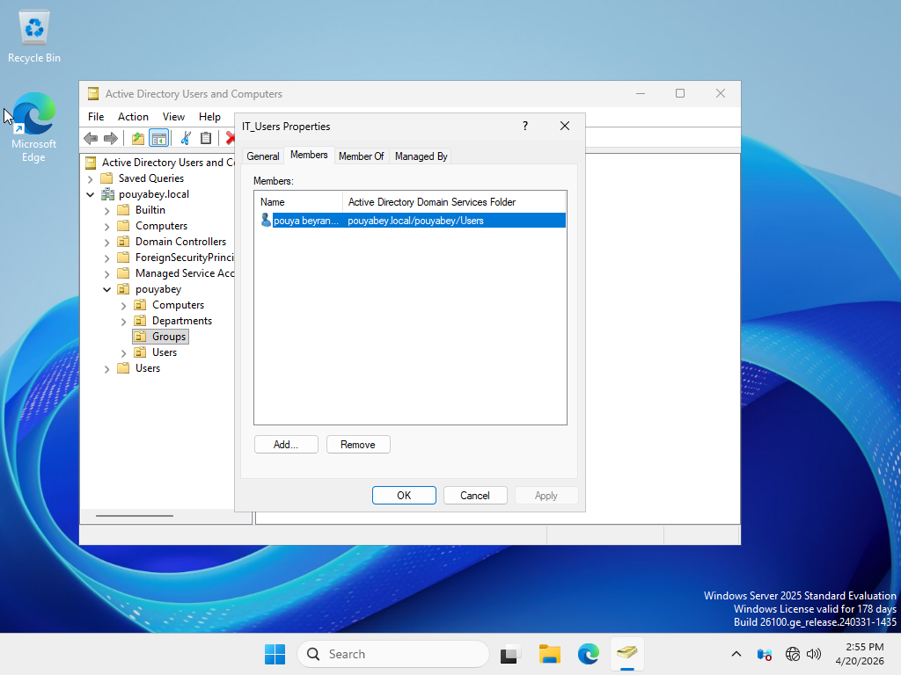
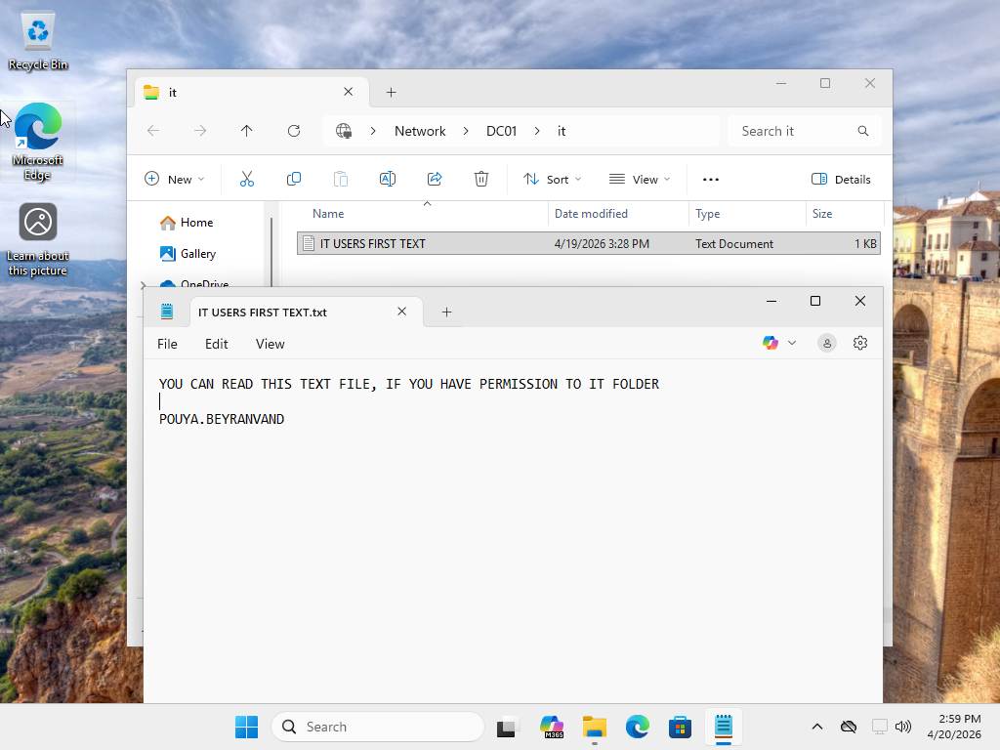

# Ticket 03: Shared Folder Access Denied

## User Report

The user reported that they could not access a shared network folder. When attempting to open the shared folder, the user received an access denied message.

## Lab Environment

- Windows Server Domain Controller
- Windows 11 domain-joined client
- Active Directory Domain Services
- Host-only virtual network
- Shared folder hosted on the Domain Controller
- Security group-based folder access

## Initial Symptoms

The Windows 11 client could reach the server, but the user could not open the shared folder. The issue appeared to be related to permissions rather than network connectivity.

## Shared Resource

- Server: `DC01`
- Shared folder: `\\DC01\Finance`
- Security group required for access: `Finance-Users`

## Possible Causes Considered

- User was not a member of the required Active Directory security group
- Incorrect Share Permissions
- Incorrect NTFS Permissions
- User had not signed out and signed back in after a group membership change
- Incorrect shared folder path
- Cached credentials or old access token

## Troubleshooting Steps

1. Confirmed the user was attempting to access the correct shared folder path: `\\DC01\Finance`.
2. Verified that the Windows 11 client could reach the server.
3. Confirmed that the user received an access denied message when opening the shared folder.
4. Checked the user's current identity using `whoami`.
5. Checked the user's group membership using `whoami /groups`.
6. Identified that the user was not a member of the required `Finance-Users` security group.
7. Reviewed the folder access requirement and confirmed that access was controlled through Active Directory group membership.
8. Added the user to the `Finance-Users` security group in Active Directory.
9. Signed the user out and back in to refresh the user's group membership token.
10. Verified the updated group membership using `whoami /groups`.
11. Retested access to `\\DC01\Finance`.
12. Confirmed read/write access by creating a test file in the shared folder.

## Commands Used

```cmd
whoami
whoami /groups
dir \\DC01\Finance
echo Access test successful > \\DC01\Finance\access-test.txt
```

## Root Cause

The user was not a member of the required Active Directory security group for the shared folder. The server and shared folder were reachable, but NTFS permissions only allowed access to members of the Finance-Users group.

## Resolution

The user was added to the Finance-Users security group in Active Directory. After signing out and signing back in, the user’s group membership token was refreshed, and access to the shared folder was restored.

## Verification

The issue was verified as resolved by successfully accessing the shared folder from the Windows 11 client:
```
dir \\DC01\Finance
echo Access test successful > \\DC01\Finance\access-test.txt
```

## Screenshots

### 1. Access Denied When Opening Shared Folder



### 2. User Group Membership Before Fix



### 3. User Added to IT Security Group



### 4. Shared Folder Access Restored



