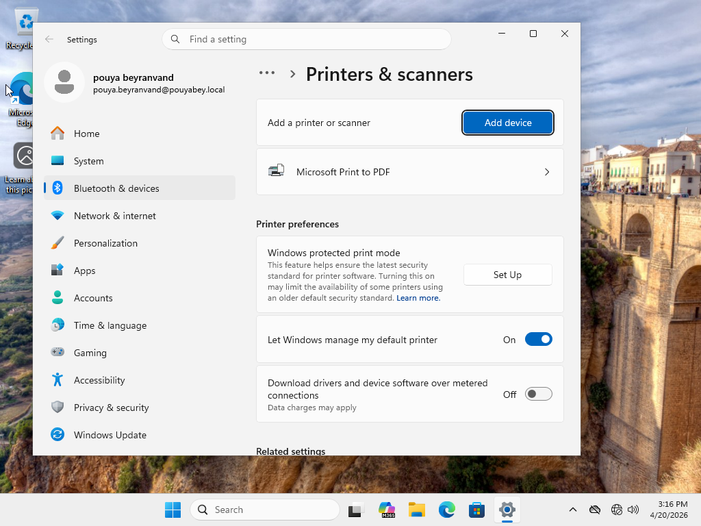
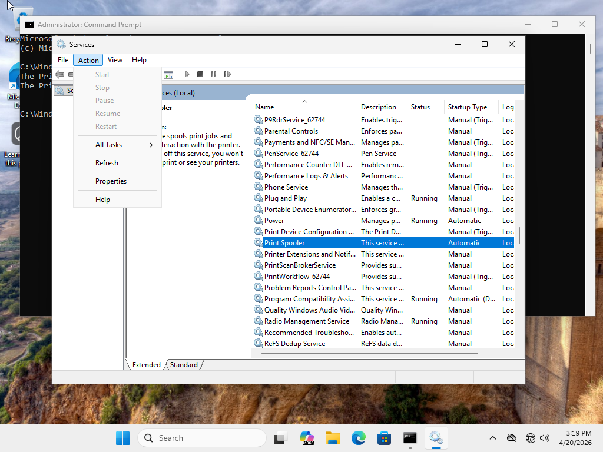
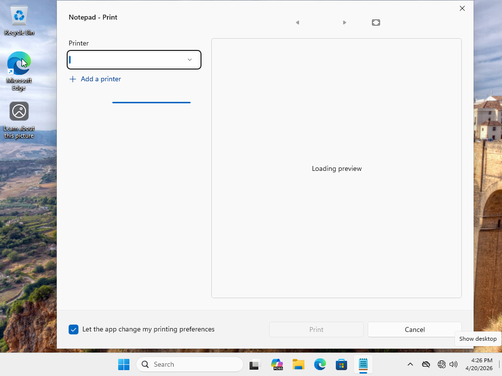
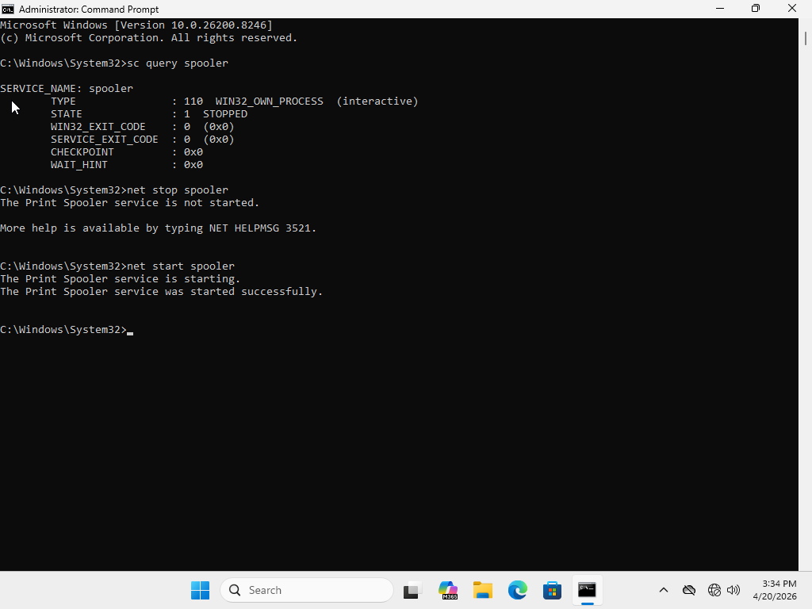
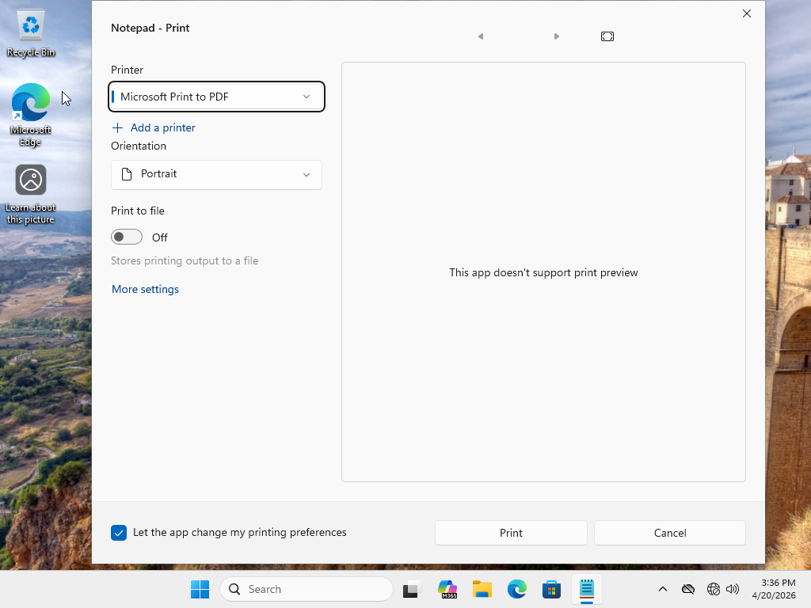

# Ticket 04: Printer Not Working

## User Report

The user reported that they could not print from their Windows workstation. The printer was installed, but print jobs were not completing successfully.

## Lab Environment

- Windows 11 domain-joined client
- Windows Server Active Directory lab environment
- Host-only virtual network
- Microsoft Print to PDF / installed local printer
- Windows Print Spooler service

## Initial Symptoms

The printer appeared to be installed on the workstation, but the user was unable to complete a print job. The issue appeared to be related to the local Windows printing service rather than network connectivity.

## Possible Causes Considered

- Print Spooler service stopped
- Printer set to offline
- Wrong default printer selected
- Stuck print queue
- Printer driver issue
- Local Windows printing service issue

## Troubleshooting Steps

1. Verified that a printer was installed on the Windows 11 client.
2. Checked the default printer and printer status.
3. Reviewed the print queue for stuck jobs.
4. Checked the Print Spooler service status.
5. Confirmed that the Print Spooler service was not running.
6. Restarted the Print Spooler service.
7. Verified that the Print Spooler service returned to a running state.
8. Retested printing using a test document.
9. Confirmed that the print workflow completed successfully.

## Commands Used

```cmd
control printers
sc query spooler
net stop spooler
net start spooler
```

## Root Cause

The Print Spooler service was stopped, preventing the workstation from processing print jobs.

## Resolution

The Print Spooler service was restarted. After the service returned to a running state, the printer was tested again and the print workflow completed successfully.

## Verification

The issue was verified as resolved by confirming that the Print Spooler service was running and completing a test print.
```
sc query spooler
```
## Screenshots

### 1. Installed Printers



### 2. Print Spooler Service Stopped



### 3. Printing Failure Confirmed



### 4. Print Queue Review


### 5. Print Spooler Restarted Successfully



### 6. Test Print Successful


