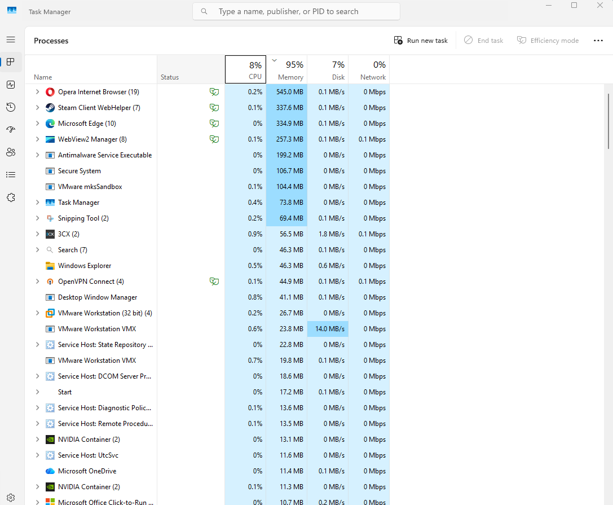
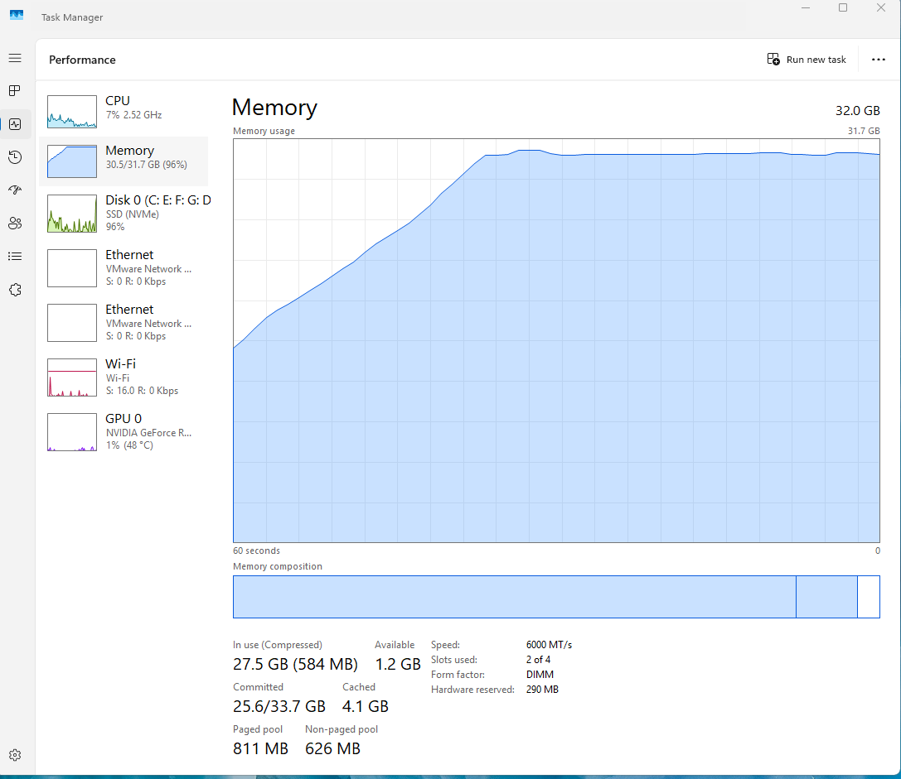
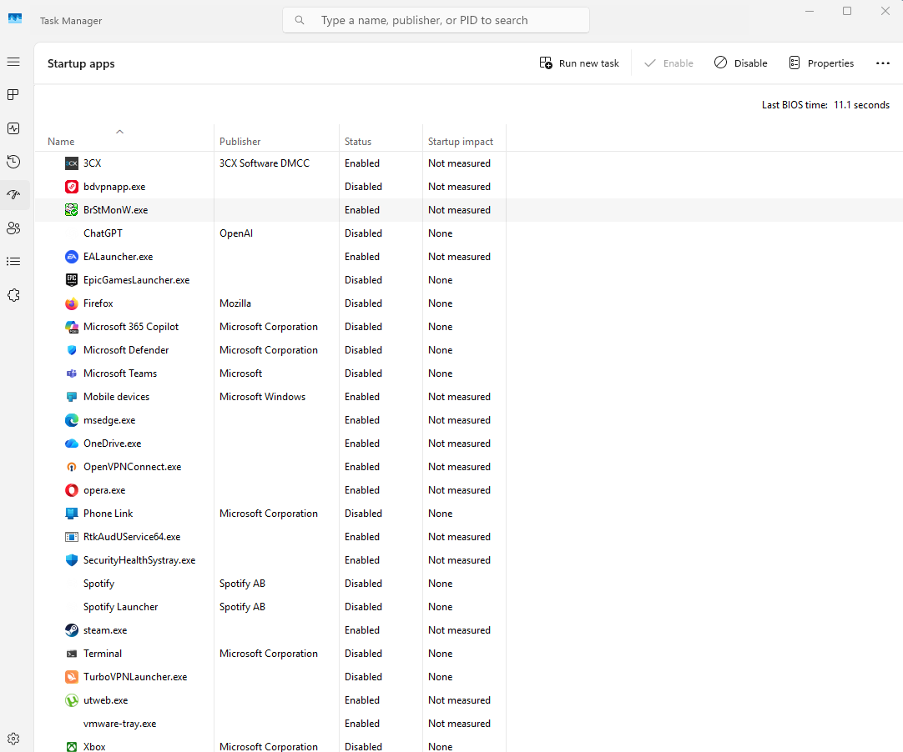
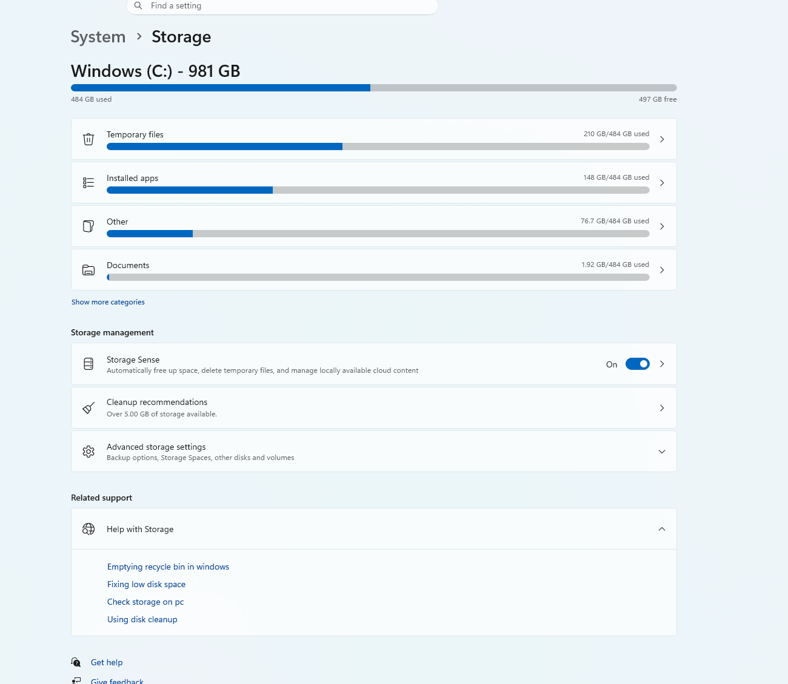
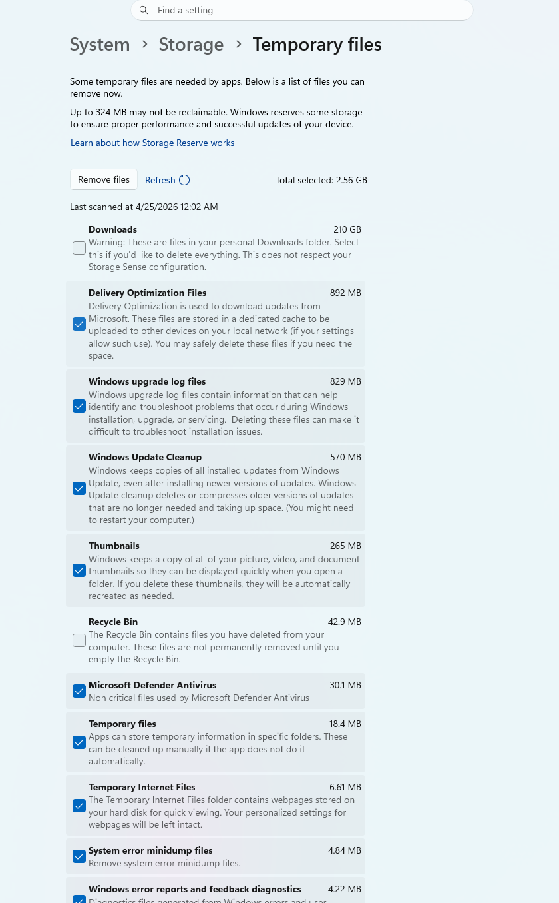
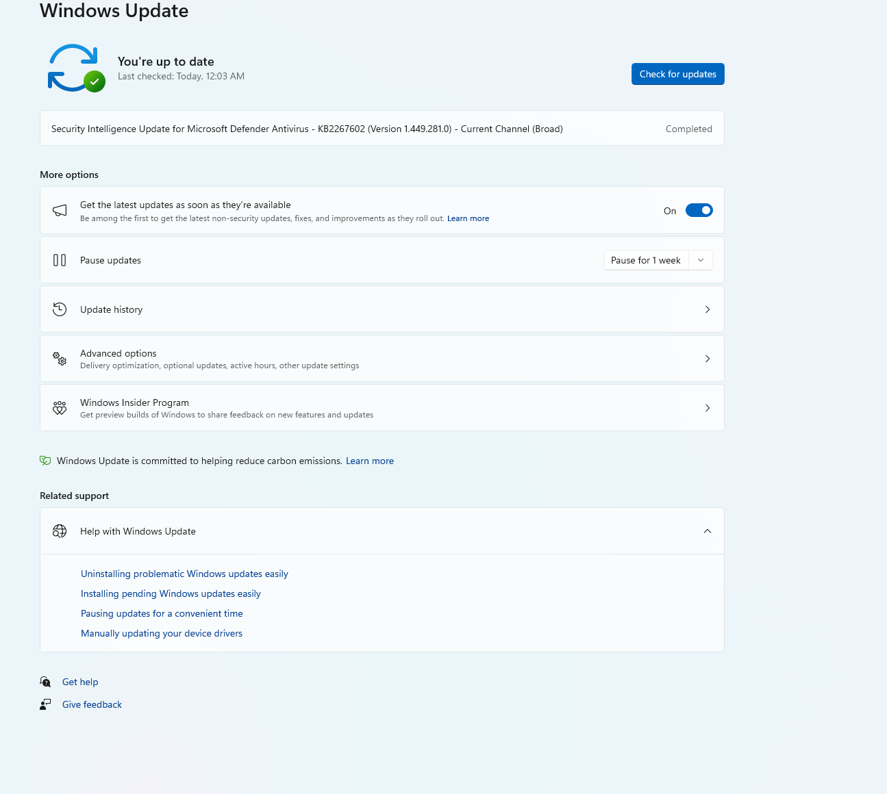
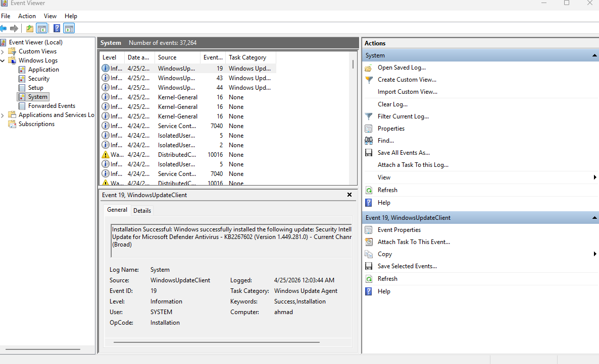
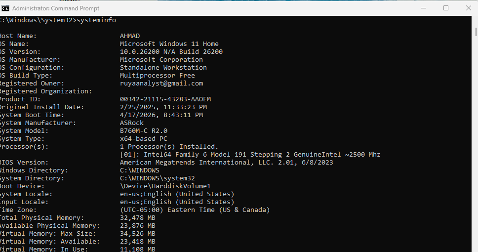
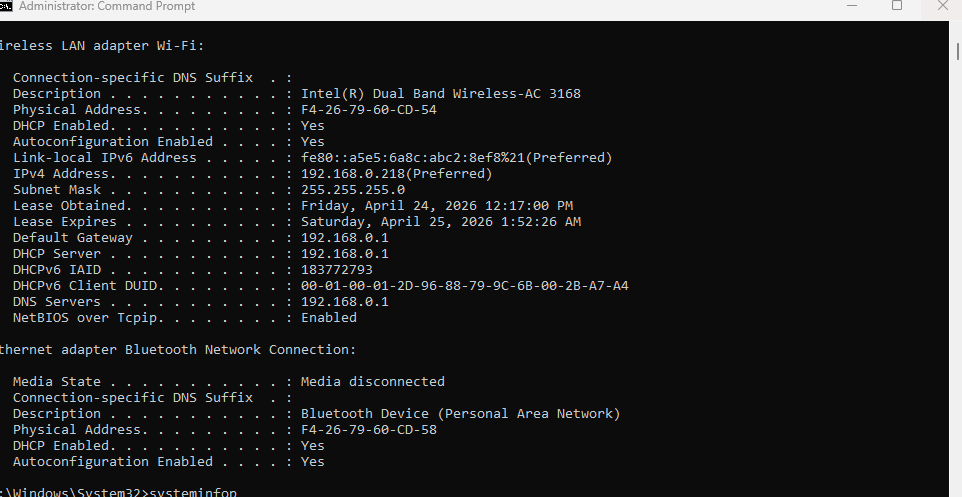
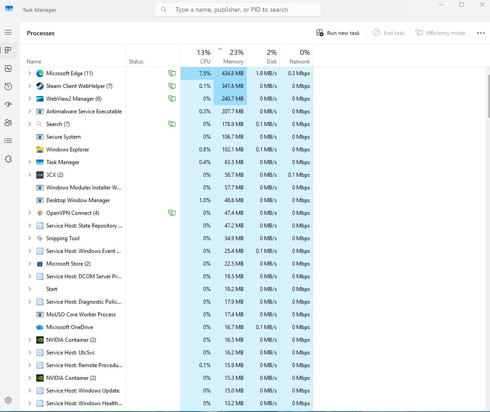

# Ticket 05: Slow Computer Performance

## User Report

A user reported that their Windows 11 workstation was running slowly. Applications were taking longer than usual to open, and the system felt slow during normal daily use.

## Ticket Details

| Field | Value |
|---|---|
| Ticket Type | Incident |
| Category | Windows Endpoint Support |
| Priority | Medium |
| Status | Resolved |
| Affected Device | Windows 11 domain-joined workstation |
| Environment | Active Directory home lab / host-only virtual network |
| Business Impact | User productivity was reduced due to slow application response and delayed system performance |

## Initial Symptoms

- Workstation felt slow during normal use
- Applications opened slowly
- System performance needed to be reviewed
- Possible causes included high resource usage, unnecessary startup apps, low disk space, temporary files, pending updates, or system errors

## Troubleshooting Steps

### 1. Task Manager Performance Reviewed

Task Manager was opened to review CPU, memory, disk, and network usage. This helped determine whether the workstation was experiencing high resource utilization.

### 2. Running Processes Checked

The Processes tab in Task Manager was reviewed to identify applications or background processes using high CPU, memory, or disk resources.

This step helped determine whether a specific application was contributing to the performance issue.

### 3. Startup Apps Reviewed

Startup apps were reviewed to identify unnecessary applications launching automatically when the user signs in.

Unnecessary startup apps were disabled to reduce login time and background resource usage.

### 4. Disk Space Checked

Available disk space was checked to confirm that the workstation had enough free storage for normal Windows operation.

### 5. Temporary Files Reviewed and Cleaned

Temporary files were reviewed through Windows Storage settings. Safe temporary files were selected for cleanup.

The Downloads folder was not selected in order to avoid removing user files.

After cleanup, storage was reviewed again to confirm that temporary files were removed.

### 6. Windows Update Status Checked

Windows Update was reviewed to check for pending updates, failed updates, or restart requirements.

### 7. Event Viewer System Logs Reviewed

Event Viewer was opened and the System log was reviewed for repeated errors or warnings related to system performance, disk issues, service failures, drivers, or update problems.

### 8. Final Verification Completed

After reviewing startup apps, storage, temporary files, Windows Update, and system logs, the workstation was restarted and performance was verified again.

## Root Cause

The workstation had unnecessary startup applications and accumulated temporary files that could contribute to slower performance during sign-in and normal use.

No major system errors were identified during the basic help desk review.

## Resolution

- Reviewed Task Manager performance metrics
- Checked running processes for high resource usage
- Disabled unnecessary startup apps
- Checked disk space
- Reviewed and cleaned temporary files
- Verified Windows Update status
- Reviewed Event Viewer system logs
- Restarted the workstation
- Confirmed improved or stable system performance after troubleshooting

## Verification

The workstation was restarted after troubleshooting. Task Manager and storage settings were reviewed again to confirm that the system was stable and usable.

## Skills Demonstrated

- Windows 11 endpoint troubleshooting
- Task Manager performance review
- Startup application management
- Disk space and temporary file cleanup
- Windows Update verification
- Event Viewer log review
- Help desk documentation
- Root cause analysis
- End-user support workflow
